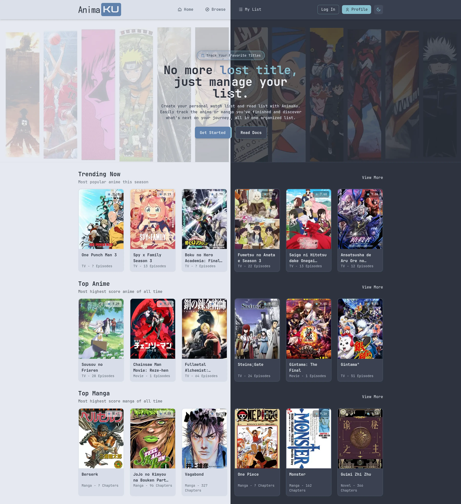
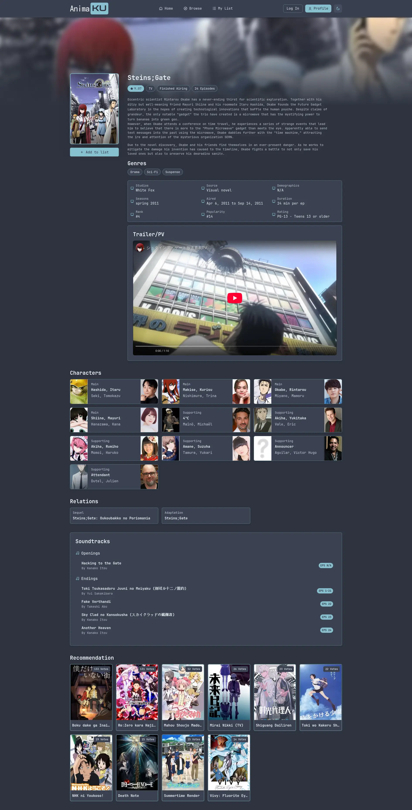
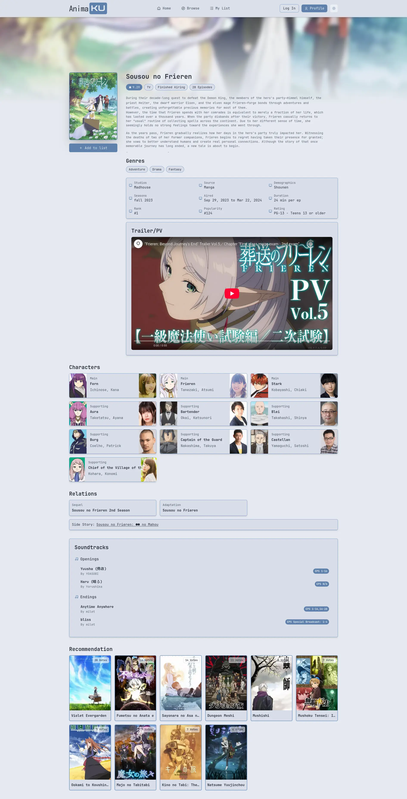

# Still on development for v.2.0.0

If you want see the old source code just head to branch release/v1.0.0 or click [here](https://github.com/21Chillie/animaku_web/tree/release/v1.0.0)

11/11/2025 to ??

The project will be refactor and rewritten in TypeScript, with all code organized into modular structure to improve development efficiency and scalability.

Tech Stack:
Maybe there is some minor changes.
Node.js or Bun, Express or Hono, EJS, TailwindCSS.

| Folder           | Responsibility                           | Example                |
| ---------------- | ---------------------------------------- | ---------------------- |
| **config/**      | Environment setup (e.g., DB connection)  | `database.ts`          |
| **controllers/** | Handle HTTP requests and responses       | `animeController.ts`   |
| **routes/**      | Define Express routes                    | `animeRoutes.ts`       |
| **middlewares/** | Custom middleware (logger, errors, etc.) | `errorHandler.ts`      |
| **services/**    | Business logic (API fetch, cache)        | `animeService.ts`      |
| **models/**      | Database operations                      | `animeModel.ts`        |
| **types/**       | Type definitions for data                | `anime.ts`             |
| **utils/**       | Helper functions                         | `formatters.ts`        |
| **public/**      | Static files (CSS, JS, images)           | `/css/style.css`       |
| **views/**       | EJS templates for UI                     | `anime.ejs`, `404.ejs` |

---

## About AnimaKu

AnimaKu is a web application built with Node.js, Express, EJS, TailwindCSS, and PostgreSQL that allows users to search, browse, and manage their personal anime or manga lists. It integrates with the JIKAN API to fetch up-to-date anime/manga data while caching information in PostgreSQL for faster performance.

---

## Demo

---

## Todo List:

- [x] Setup project
- [x] Testing the Jikan API
- [x] Design the database

**Redesign homepage (COMPLETED)**

- [x] Navbar
- [x] Navbar logic for collapse
- [x] Toggle dark/light colors
- [x] Hero section
- [x] Popular anime section :
  - [x] Write logic for fetch data
  - [x] Write logic for storing the data
  - [x] Get the data and render for this section
- [x] Top anime section :
  - [x] Write logic for fetch data
  - [x] Write logic for storing the data
  - [x] Get the data and render for this section
- [x] Top manga section :
  - [x] Write logic for fetch data
  - [x] Write logic for storing the data
  - [x] Get the data and render for this section

**Overview Section (COMPLETED)**

- [x] Design overview section
- [x] Write logic for fetch anime data and storing to database
- [x] Write logic for fetch anime character data and storing to database
- [x] Write logic for fetch anime relation data and storing to database
- [x] Write logic for fetch anime recommendation and storing to database
- [x] Write logic for fetch manga data and storing to database
- [x] Write logic for fetch manga character data and storing to database
- [x] Write logic for fetch manga relation data and storing to database
- [x] Write logic for fetch manga recommendation and storing to database
- [x] Render all the data for overview page
- [x] Need to add ending and opening OST (or will delete that section)

**Top and Trending List Page (Anime/Manga) (COMPLETED)**

- [x] Design list page with limit and pagination
- [x] Make the page render correct information like title, description and head title (ejs render)
- [x] Ive decided to use javascript fetch to render the data (client side render (CSR)), because using SSR (server side render) method the page has to be fully refresh to get the data. With CSR using JS fetch, i can get the data from API (which is from database) and then dynamically render the data using DOM.
- [x] Use javascript fetch to get data from api endpoint that has been made before (the data from database)
- [x] Add limit page function for showing data (10/15/25 records)
- [x] Render the cards with correct data
- [x] Add pagination function for showing data each page (this part is so hard)
- [x] Thanks to Deepseek (Goated AI btw) for making the pagination function worked :D

**Character Section (COMPLETED)**

- [x] Design character page
- [x] Write logic for fetch character full data and storing it to database
- [x] Render correct character data by mal_id in character page

**Browse Section (COMPLETED)**

- [x] Design browse page (with search filter, order by, filter by type or status,)
- [x] Make logic when selecting media type (anime/manga) the filter type and status option will change too according to type and status from anime or manga
- [x] Finish filter button to open modal popup (filters) when mobile
- [x] Finish javascript logic for fetch data from api

**User & Authentication (COMPLETED)**

- [x] Design login and sign up page
- [x] Add validator for all input in login and sign up page
- [x] Add function for toggle hide/see password
- [x] Add routes for login and sign up page
- [x] Create function for hashing password
- [x] Create function for storing password in database
- [x] Create function for get user credentials by username, id, email, google id
- [x] Create function for insert and update user account
- [x] Setup passport local and google oauth
- [x] Create function for login with username and password
- [x] Create function for login with google
- [x] All function for local/google signup or login is working
- [x] Show profile in navbar when user login
- [x] Create logout button so user can logout their account

**User Features and User List**

- [ ] Do this

**Edit Profile**

- [ ] Do this

**Error Page**

- [ ] Do this

**API and Database: (COMPLETED)**

- [x] Fetch trending anime and store it to database
- [x] Fetch top anime and store it to database
- [x] Fetch top manga and store it to database
- [x] Create anime table and store both anime trending and top data
- [x] Create manga table and store top manga data
- [x] Fix rate limited from api
- [x] Create anime and manga character table
- [x] Create anime and manga relation table
- [x] Create anime and manga recommendation table
- [x] Create anime theme table
- [x] Create character full table
- [x] Fetch character full data and storing it to database

**Filter query and params(mal_id) (COMPLETED)**

- [x] Get anime by mal_id
- [x] Get manga by mal_id
- [x] Paginated and Limit query for anime top table
- [x] Paginated and Limit query for anime trending table
- [x] Paginated and Limit query for manga top table
- [x] Paginated and Limit query for anime table
- [x] Filter query with type and status for anime table
- [x] Order by query title, rank, score popularity, and year for anime table
- [x] Paginated and Limit query for manga table
- [x] Filter query with type and status for manga table
- [x] Order by query title, rank, score popularity, and year for manga table

**Typescript Type Definition**

- [x] Type definition for anime data (Database/API Response)
- [x] Type definition for character data (Database/API Response)
- [x] Type definition for relation data (Database/API Response)
- [x] Type definition for recommendation data (Database/API Response)
- [x] Type definition for anime theme data (database/api response)
- [x] Tidy up and fix

**Documentations**

- [ ] API documentation
- [ ] Repositories Documentation

---

Holy fck there so much to do ....
